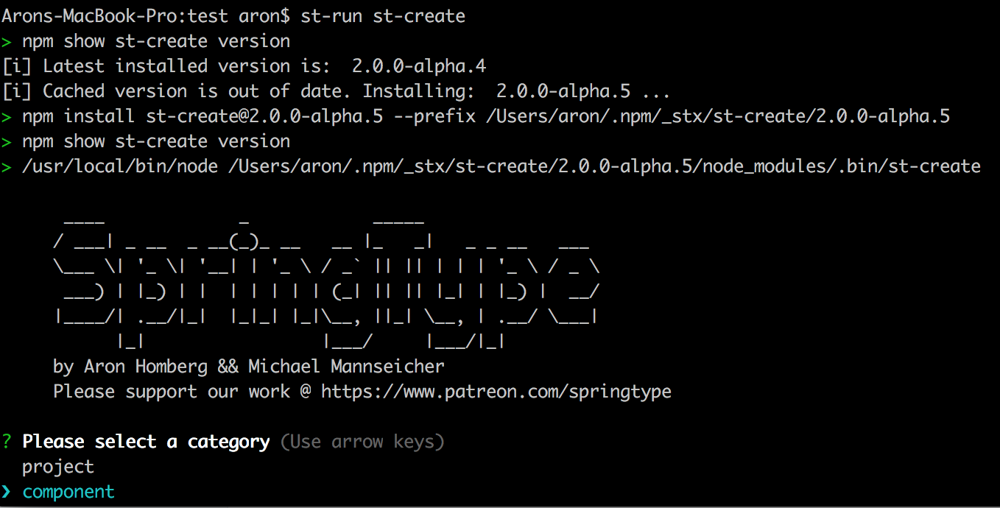

# Your first project

If you're as lazy as we are, **don't even read any further guide, just generate SpringType apps** and **play with what** `st-create`creates for you:

`$ st-run st-create`

_You'll probably notice that there is not much to learn, **it's very intuitive**  :-\)_


**You don't know** [**`st-run`**](https://github.com/springtype-org/st-run) **yet?** It's a chainable, faster, always up-to-date `npx` alternative and also a system command executor 🚀. Make sure to install it:   
`yarn global add st-run`




[**`st-create`**](https://github.com/springtype-org/st-create) is a versatile, templating based code generator:

* [x] It supports many **project templates** \(PWA, website, game, etc.\) 
* [x] It also supports your **own custom templates**
* [x] You can also **generate new components** for your app
  * [x] With templates for **standard UI's like: Login form** etc.
  * [x] In all flavors, like **Ionic**, **Google** **Material Design** and even **Bootstrap**

Did we mention that _SpringType_ comes with cool third-party framework integrations?

* [x] Ionic 4 \(official\) for PWA's
* [x] Google Material Design \(official\) for Websites
* [x] Babylon 3D for Games
* [x] OpenLayers for interactive Map Applications

This gives you a **jump-start that has never been seen before**. Have fun! 


**Any questions?** Get in touch with us on [](https://gitter.im/springtype-official/springtype?utm_source=badge&utm_medium=badge&utm_campaign=pr-badge)[💬](https://emojipedia.org/speech-balloon/)[🤓](https://emojipedia.org/nerd-face/)


### Checkout a simple demo manually [💻](https://emojipedia.org/personal-computer/)

If you'd like to try _SpringType_ without `st-create`, just open a terminal and run:

```text
git clone https://github.com/springtype-org/st-starter-web.git
```

Switch to the project directory and install the few dependencies:

```text
cd st-starter-web
yarn
```

Finally, start the dev server for HMR by running:

```text
yarn start
```


And that's it. _SpringType_ will start on: `http://localhost:4444` 

Or start a production build by running:

```text
yarn start:prod
```

Find your production build in: `./dist/index.html`


**That was easy, wasn't it?!** Let's make some changes to `src/index.tsx` and watch how HMR will auto-magically reload [👌](https://emojipedia.org/ok-hand-sign/).



**Any questions?** Get in touch with us on [](https://gitter.im/springtype-official/springtype?utm_source=badge&utm_medium=badge&utm_campaign=pr-badge)[💬](https://emojipedia.org/speech-balloon/)[🤓](https://emojipedia.org/nerd-face/)


