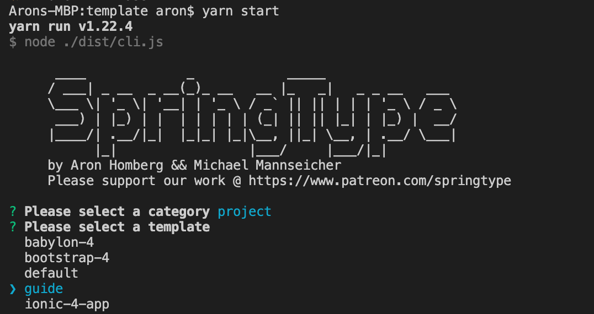

# Starting a Project

If you're just as lazy as we are, **don't even read any further guide, just generate SpringType apps** and **play with what** [**`st-create`**](https://github.com/springtype-org/st-create)creates for you:

`$ st-run st-create`


**You don't know** [**`st-run`**](https://github.com/springtype-org/st-run) **yet?** It's a chainable, faster, always up-to-date npx alternative and сross-platform system command executor 🚀.   
Make sure to install: `yarn global add st-run`




### Checkout a simple demo manually [💻](https://emojipedia.org/personal-computer/)

If you'd like to try _SpringType_ without `st-create`, just open a terminal and run:

```text
git clone https://github.com/springtype-org/st-starter-web.git
```

Switch to the project directory and install the few dependencies:

```text
cd st-starter-web
yarn
```

Finally, start the dev server for HMR by running:

```text
yarn start
```


And that's it. _SpringType_ will start on: `http://localhost:4444` 

Or start a production build by running:

```text
yarn start:prod
```

Find your production build in: `./dist/index.html`


**That was easy, wasn't it?!** Let's make some changes to `src/index.tsx` and watch how HMR will auto-magically reload [👌](https://emojipedia.org/ok-hand-sign/).



**Any questions?** Get in touch with us on [](https://gitter.im/springtype-official/springtype?utm_source=badge&utm_medium=badge&utm_campaign=pr-badge)[💬](https://emojipedia.org/speech-balloon/)[🤓](https://emojipedia.org/nerd-face/)


