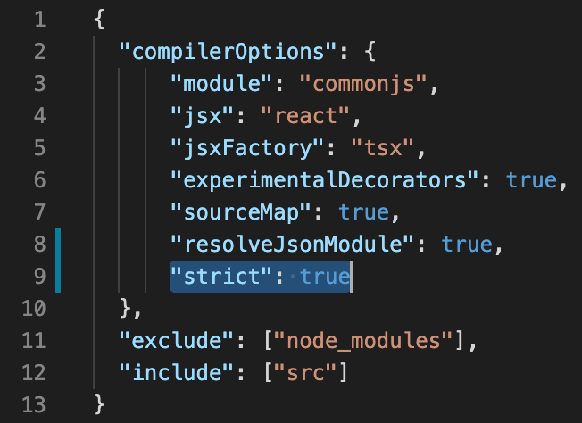

# A. Why TypeScript?



SpringType is a typed superset of JavaScript. It feels like JavaScript, but with some type enhancements. You'd just switch from `.js` file extension to `.ts` for all files not containing TSX syntax. Type safety is optional. Valid JavaScript code is valid TypeScript code. You can disable type checks or use types like `any` and `unkown`.

**Pros and Cons of type safety**

Developing with type safety frees you from all kinds of bugs - already at compile time.  Using TypeScript evicts the need of runtime type checking overhead. SpringTypes build system uses _Babel 7_ under the hood, that's how we manage to get super-fast build times.

You'll also get auto-completable API's  and better tooling if you ever want to  refactor your code. With typing information, your IDE has a much better chance to analyze the structure and meaning of the code:

```typescript
interface IGreeting {
    text: string;
    mode: EGreetingMode;
}

enum EGreetingMode {
    PUSH_NOTIFICATION,
    MODAL
}

const sendGreeting = async(greeting: IGreeting) => { ... }
```


**Better install a popular IDE**

We recommend  to work with an IDE like [VS Code](https://code.visualstudio.com/) or [WebStorm](https://www.jetbrains.com/webstorm/) to name two popular ones. This makes sure you'll have less struggle finding imports, get auto-completable API's and see issues ahead of build time.


**Strict type-safety**

In case you like very strict type checking, you can enable the **`strict`** mode in **`tsconfig.json`**:





TypeScript allows us to use the TSX domain-specific language. TSX is typed JSX and JSX is an XML-syntax to describe a virtual DOM \(HTML-like\) structure which is being transformed into JSON by the TypeScript compiler:


```typescript
import { st } from "springtype/core";
import { tsx } from "springtype/web/vdom";

st.render(
  <p>SpringType: Simplicity is key! :-)</p>
);
```



`st.render()` renders to document.body by default, but you can set any other existing DOM element target, e.g. to do portal rendering:   
`st.render(<p>Portal</p>, document.querySelector('.user-panel'))`


In the guide we render the whole app with this command:


```typescript
...

st.render(<Guide />)
```



The correct file extension for TypeScript source files containing TSX syntax is `.tsx` . There is also a requirement for importing the `tsx` function from module `springtype/web/vdom` 


SpringTypes build system takes the transformed JSON structure, optimizes it by processing it in the `tsx` transformation function and renders it out as native HTML and SVG elements.

**Fragments, Interpolations, Comments**

Sometimes, you might need to directly return an array of virtual elements to be rendered, because there should be none in between. Therefore, you'd use `<>` and `</>` in React, but `<fragment>` in SpringType. We find this a bit more self-explanatory. For sure, TSX supports comments and interpolations too:


```typescript
import { component } from "springtype/web/component";
import { tsx } from "springtype/web/vdom";
import { st } from "springtype/core";

@component
export class FragmentDemo extends st.component {
  render() {
    return <fragment>
      {/* Some random values */}
      <p>A {Math.random()}</p>
      <p>B {Math.random()}</p>
    </fragment>
  }
}
```


**Clean DOM**

SpringType has no complex VDOM algorithm and no magic DOM abstraction that would stand between you and your code. In result, the rendered HTML code will always be a clean DOM and look just as you'd expect it. For _Components_, you have a free choice on the _tag name_, that is used to render your component.:

```markup
...
<body>
  <p>SpringType: Simplicity is key! :-)</p>
</body>
...
```



We do often use external libraries to quickly implement features that otherwise would take hours to implement on our own. Therefore we call e.g. `yarn add st-materialize` to import and use the beautiful Material Design `<MatInput />` component from our [officially supported Materialize.css library](https://github.com/springtype-org/st-materialize).

The best practice to import such `npm` modules is:

```typescript
import { st } from "springtype/core";
import { tsx } from "springtype/web/vdom";
import { MatInput } from "st-materialize";

st.render(<MatInput label="Hello, world!" />);
```

However, these imports are static and thus result in larger code sizes compared to dynamic imports which can be used to split code in smaller chunks.

**Default imports**

Another way to import modules is using the default import syntax:

```typescript
import * as tpl from "./button.tpl";
```

Please note that we don't need to name the file extension. The imported file could look like this:

```typescript
export default () => <p>My template</p>
```

**The old way: `require`**

Sometimes we need to use a pretty old JavaScript library, maybe one without typings. In this case, the most easy way is to `require()` such a library:

```typescript
const chalk = require('chalk');
```



Based on the dynamic import feature of TypeScript, static code dependencies can be replaced by a technique that loads code on demand:

```typescript
import { run } from "springtype/core/lang/run";

const loadModuleB = async() => {
  return import('../module-b');
}

run(async() {
  const moduleB = await loadModuleB();
});
```

This way, the build system can optimize production builds for smaller, differentiated on-demand code delivery. Several chunks of code will be written out and loaded only when the functions that require it, are called. 

However, smaller initial code size comes with the gotcha that when the function is called \(e.g. because a user clicks on a button to visit a deeply nested page\), time will pass before the code is executed and the UI becomes available to the user.


SpringTypes DOM Router has built-in support for dynamic imports and code splitting.




Typically asynchronous code flows have been quite difficult to handle. You might remember so called _"callback hells"_,  or the diversity of opinions on _Promises_. 

In SpringType, you can easily mix synchronous and asynchronous code using `async`/`await` - it still looks very much like synchronous code. When you use `await`, the program waits until the \(internal\) `Promise` will be fulfilled. If there is an exception, you can catch it with the `try` / `catch` method. 

This technique is often combines with the use of fat arrow functions:

```typescript
import { st } from "springtype/core";
import { tsx } from "springtype/web/vdom";
import { run } from "springtype/core/lang/run";

const loadUsers = async() => fetch('/users');

run(async() => {

  try {
    const users = await loadUsers();
  } catch(error) {
    // handle error here
  }
  st.render(users.map(user => <p>user.name</p>), document.body);
});
```

This is especially helpful with classes where fat arrow functions make sure that the `this`-scope is pointing to the class instance all the time:

```typescript
class Sample {
  loadUsers = async() => fetch('/users');
}

run(async() => {
  await new Sample().loadUsers();
});
```


If you're still wondering when and why you should use fat arrow functions, just make it a habit to use this syntax in all cases of component event handlers.




On top of the TypeScript standard library, we've implemented some functions to provide you with the tools to implement reactive call flows without the need to use streams.

**Run**

Runs a function synchronously or asynchronously and returns its result:

```typescript
import { run } from "springtype/core/lang/run";

const result = run(async() => {
  ...
});
```

**Debounce**

Transforms a function into one that is called only once in  `n` milliseconds, no matter how often it is actually called:

```typescript
import { debounce } from "springtype/core/lang/debounce";

const sendRequestDebounced = debounce(async(...params) => {
    ...
}, /*ms*/ 500);

sendRequestDebounced(...);
```

**Delay**

Transforms a function into one whose calls are alway delayed by `n` milliseconds:

```typescript
import { delay } from "springtype/core/lang/delay";

const sendRequestDelayed = delay(async(...) => {
    ...
}, /*ms*/ 500);

sendRequestDelayed(...);
```

**Immediate**

Transforms a function into one that calls its code at the next JavaScript VM tick. This is helpful if JavaScript code must wait until synchronous DOM operations has finished:

```typescript
import { immediate } from "springtype/core/lang/immediate";

const sendRequestImmediate = immediate(async(...params) => {
    ...
});

sendRequestImmediate(...);
```

**AnimationFrame**

Transforms a function into one that calls its code after the browsers current rendering has been refreshed. This allows to implement smooth animations whose parameters are calculated or set using JavaScript \(e.g. you're setting DOM element `style` properties\):

```typescript
import { animationFrame } from "springtype/core/lang/animation-frame";

const calcAnimation = animationFrame(async(...params) => {
    ...
});

calcAnimation(...);
```

**Tap**

This function takes a value, logs it via `st.log` and references it to the global scope via `$tap` or a custom tap name. It also returns the value. This is useful as an intermediate debugging tool:

```typescript
import { tap } from "springtype/core/lang/tap";

lost(inFunctional(tap(code())));

// the return of tap is seamlessly logged and 
// referenced as globalThis.$tap

lost(tap(inFunctional(tap(code(), 'code'), 'inFunctional')));

// globalThis.$code, globalThis.$inFunctional

// btw: globalThis refers to window in browsers
```




**Still wondering about a thing?** Get in touch with us! [](https://gitter.im/springtype-official/springtype?utm_source=badge&utm_medium=badge&utm_campaign=pr-badge)[💬](https://emojipedia.org/speech-balloon/)[🤓](https://emojipedia.org/nerd-face/)



**Found a bug or misleading information?** [Please report an issue.](https://github.com/springtype-org/springtype/issues)


