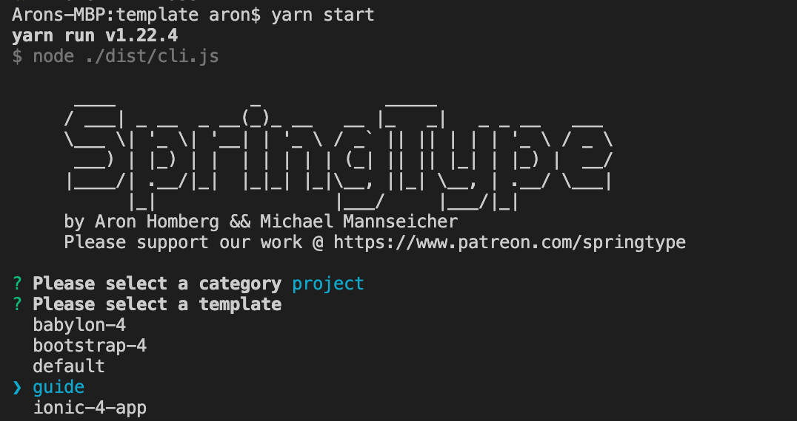

# B. Starting a new project

We're programmers and that means, we want our work to not be repetitive :-\)  
  
So, let's lay back and let the SpringType scaffolding tool [**`st-create`**](https://github.com/springtype-org/st-create)set up a project for you:

`$ st-run st-create`


**You don't know** [**`st-run`**](https://github.com/springtype-org/st-run) **yet?** It's a chaining, fast `npx` alternative and сross-platform command executor 🚀.   
  
If you face something like `st-run: Command not found`, make sure to run: `yarn global add st-run`



**Not working?**

You're probably missing `yarn` on your system. [Just install yarn and try again.](https://classic.yarnpkg.com/en/docs/install/)



**Still not working?**

Most probably, you're missing Node.js and `npm` on your system. [Just install Node.js and try again.](https://nodejs.org/en/)


If everything goes well, you should see this beautiful screen:



Let's start with choosing `project` with the  `guide` template. You can chose an arbitrary name for this project. It's just to learn about SpringType. 

When the scaffolding finishes, the SpringType build system `st-start` will start on: `http://localhost:4444` assuming that the environment is `development`. You can always restart the DevServer by running `yarn start`.

Open a browser and point it to, [`http://localhost:4444`](http://localhost:4444), you should see the SpringType guide by now.


**HMR \(Hot Module Replacement\)** makes sure that each time you change source files or assets, the website will be reloaded.



**Oh, snap!** The directory matters. When `st-create` generates a project for you and you exit from yarn start \(`st-start`\), you'll return to the parent directory of your project. Make sure to run yarn start in the project directory, where you'll find the file`package.json`.


### Production builds

To create an optimized production build, just run:

```text
yarn start:prod
```

You'll find the production build files: `./dist`. 


Only with production builds you'll see **Code Split** working the way it's designed.


### Advanced build system configuration

There is much more to learn about the SpringType build system. In fact, we've made sure that every nifty detail of the build, environment configuration and additional tasks that might be required to run in your project, [are configurable](../bundle-1.md).


**Still wondering about a thing?** Get in touch with us! [](https://gitter.im/springtype-official/springtype?utm_source=badge&utm_medium=badge&utm_campaign=pr-badge)[💬](https://emojipedia.org/speech-balloon/)[🤓](https://emojipedia.org/nerd-face/)



**Found a bug or misleading information?** [Please report an issue.](https://github.com/springtype-org/springtype/issues)


