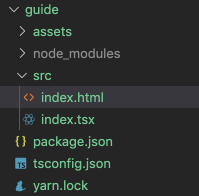
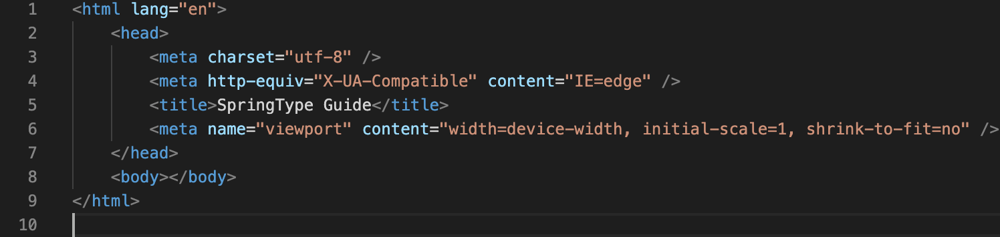
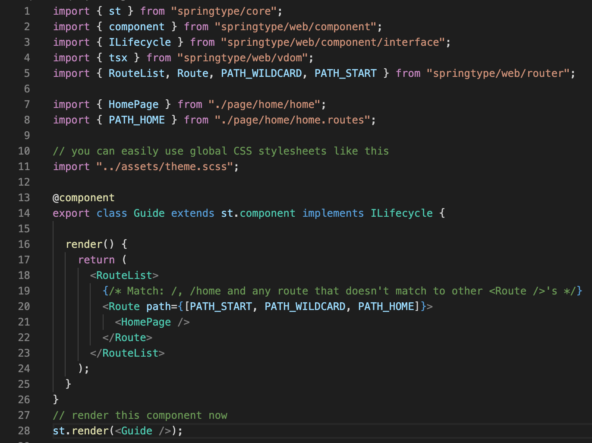
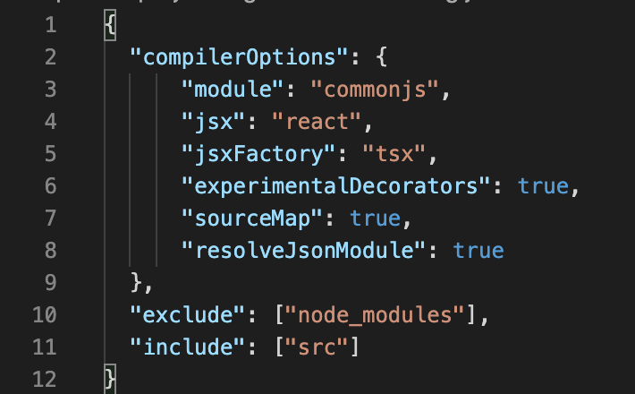
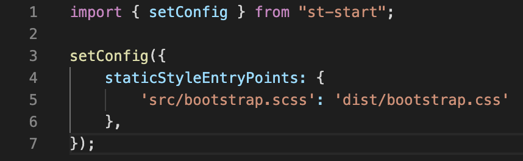

# C. Anatomy of a project

Once you've generated your first SpringType project, you'll notice a few files and folders: 

All source files should be placed in the directory `src` and assets like images and fonts should be copied into the `assets` directory. The `node_modules` folder contains JavaScript dependency packages installed via `yarn`/`npm` . It's a good practice to ignore this directory and exclude it from version control and IDE code indexing.

**Entrypoint: `src/index.html`**

This file contains references to JavaScript and CSS resources bundled by the SpringType build system and DevServer `st-start`. You can also set the project HTML title, meta tags and add additional resources like custom CSS and JavaScript. You don't need to add any references here manually. `st-start` will take care of everything auto-magically.

**Entrypoint: `src/index.tsx`**

This file is the entry point for your TypeScript and TSX code. Usually, this is just a simple SpringType component that renders a `<RouteList>` for DOM routing in multi-page setups. We're also importing the file `assets/theme.scss` here to apply global CSS styles.

**Node package config: `package.json`**

This file describes your project in terms of the [Node.js](https://nodejs.org/) / [npm](https://npmjs.com) / [yarn](https://yarnpkg.com/en/) ecosystem. [If that doesn't sound familiar, please read on here](https://nodejs.org/en/knowledge/getting-started/npm/what-is-the-file-package-json/).

**TypeScript config: `tsconfig.json`**

This file contains the projects TypeScript configuration. There are a few requirements for any SpringType project that must be met:

Usually there is no need to touch this file ever again after is has been created once. However, it's a good think to know [how it works](https://www.typescriptlang.org/docs/handbook/tsconfig-json.html).

**Optional: `yarn.lock`**

In SpringType we favor the `yarn` package manager for `Node.js`/`npm` package management. You can out out and use `npm` instead. However, we'd not advice this because `npm` is still known to run into whole error classes that are unknown in yarn. The yarn.lock file makes sure that the same versions of npm packages are installed on every system when the project is checked out across more than one machines. [Read more about this here](https://classic.yarnpkg.com/en/docs/yarn-lock/).

**Optional: `st.config.ts`**

The `st-start` build system is a DevServer and likewise a tool for production builds of your project. Its behavior can be be configured in many ways. To do so, you'd just create a file called `st.config.ts` in the root directory of your project \(next to `package.json`\):

If you're interested to learn more about `st.config.ts`, you can find the documentation of all options available in the [`IBuildConfig` interface](https://github.com/springtype-org/st-start/blob/master/src/interface/ibuild-config.ts).


**Still wondering about a thing?** Get in touch with us! [💬](https://emojipedia.org/speech-balloon/)[🤓](https://emojipedia.org/nerd-face/)



**Found a bug or misleading information?** [Please report an issue.](https://github.com/springtype-org/springtype/issues)


